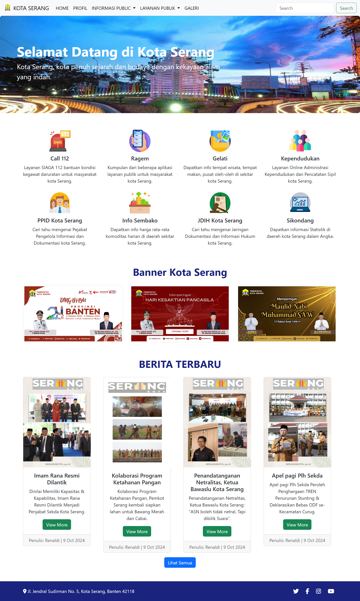

<p align="center"></p>

<h1 align="center">
   <a href="https://github.com/RegaAnton/Template_Website_Kota_Serang.git" target="_blank" align="center">
      Template Website Kota Serang
   </a>
</h1>

<p align="center">Menggunakan Bootstrap 5 sebagai Frontend</p>



## Introduction 🚀

Website Kota Serang yang masih dalam tahap pengembangan

## Installation ⚒️

Installing and running Sneat is super easy, please Follow below steps and you will be ready to rock 🤘

- Open the terminal in your root directory.

- Clone Project

```bash
git clone https://github.com/RegaAnton/Template_Website_Kota_Serang.git
```
